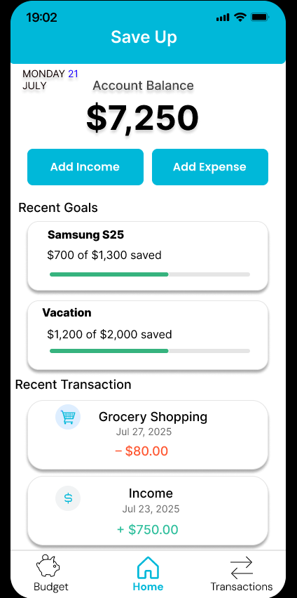

SaveUp – Budgeting App (UX/UI Case Study)

A full Figma design project including low-fidelity wireframes, design system, and high-fidelity UI.

📌 Overview

SaveUp is a mobile budgeting application created to help users track expenses, manage income, and follow their savings goals.
This project shows my complete UX/UI process—from early wireframes to a polished, interactive prototype.

🎯 My Role

UX/UI Designer

Wireframes & App Flow

Design System Creation

High-Fidelity Interface Design

Component & Variant Setup

Prototyping in Figma

🛠️ Tools

Figma (Auto Layout, Components, Variants, Prototyping)

Icon System

Mobile-first Layout

Color & Typography Standards

🧱 Low-Fidelity Wireframes

  

🎨 Design System
Buttons

  

Cards (Goals & Transactions)

  

✨ High-Fidelity Screens
Home Screen

  

Complete Screen Collection

  

🔗 Live Figma Prototype

👉 View the Interactive Prototype

(Add your public Figma link here.)

📚 What I Focused On

Clean, simple mobile UI

Consistent spacing and alignment

Clear separation between income (green) and expenses (red)

Easy visualization of financial goals

Reusable components & scalable design system

Soft shadows and rounded cards for modern look

📝 What I Learned

Building a full component/variant structure

Designing cohesive UI across multiple screens

Improving visual hierarchy with color and typography

Creating a readable financial dashboard

Structuring a full UX/UI project from start to finish

© 2025 – Designed by Anas Abbadi